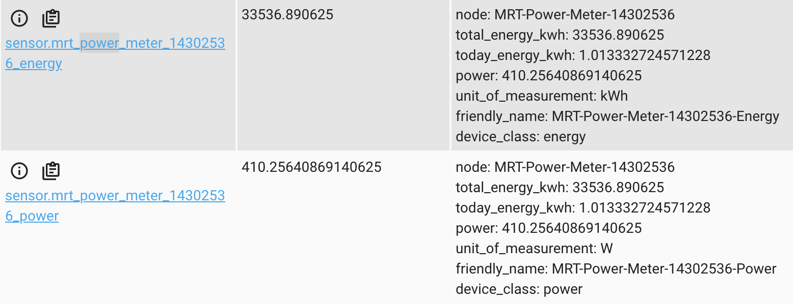
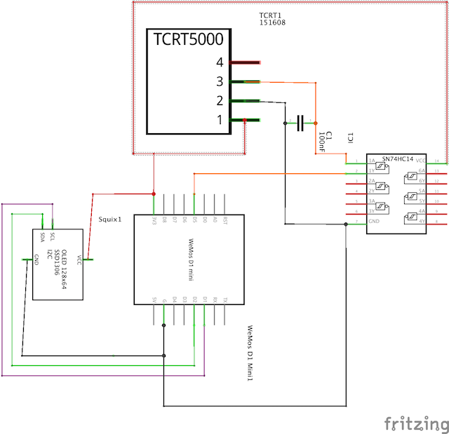

# FerrarisPowerMeter
A sensor for a ferraris power meter based on an ESP8266 or similar including a HomeAssistant-Integration via MQTT.

## Short Description
The general intention of this Arduino sketch is pretty straight forward: Read the rotations of the disc of a ferraris power meter and calculate the actual power consumption in watts and the energy consumption of the day and in total in kWh. Write all these informations on MQTT topics which are discovered from Home Assistant automatically. Additionally it show the current information on an OLED display.


## The Software

### Sketch
As already mentioned this Sketch bases on Arduino. I use the ESP8266 based Wemos D1 mini (R2) but i think you can use nearly every ESP-Microcontroller for it (not tested yet).
To make the (or even my) life easier, it uses different fantastic libraries:
* [WifiManager](https://github.com/tzapu/WiFiManager) - to manage the Wifi Connection and configuration attributes
* [PubSubClient](https://github.com/knolleary/pubsubclient) - for the MQTT handling
* [DoubleResetDetect](https://github.com/jenscski/DoubleResetDetect) - to reset the ESP and delete the stored configuration in a convinient way
* [Adafruit BusIO](https://github.com/adafruit/Adafruit_BusIO), [GFX](https://github.com/adafruit/Adafruit-GFX-Library) and [SSD1306](https://github.com/adafruit/Adafruit_SSD1306) - to communicate with the OLED display
* [Arduino_JSON](https://github.com/arduino-libraries/Arduino_JSON) - for the JSON stuff in configuration and MQTT payload

The usage of these libs is (more or less) encapsulated in corresponding own libraries, which are described (/TODO) [here](lib/README.md).

Most of it is running out-of-the-box. You may want to change your ntp server settings [here](https://github.com/mrebbert/FerrarisPowerMeter/blob/c33aa84eea5acad4d4f4d60f85a32ed460087d44/lib/NTPTime/NTPTime.h#L8).

### MQTT Broker
I use the [Mosquitto](https://mosquitto.org/) Broker which fits my requirements perfectly. You can also find an official [Docker Image](https://hub.docker.com/_/eclipse-mosquitto) of it.
I recommend a GUI based client like MQTT Explorer or MQTT.fx for testing purposes.

Once the sensor is running, you'll find three new topics on your broker:
```
|-homeassistant
  |-MRT-Power-Meter-1234 (<-- the last digits are the chip id and can vary)
    |-energy: the configuration topic of the energy sensor(kWh)
    |-power: the configuration topic of the power sensor(W)
    |-state: the sensor payload
```
### Home Assistant
The integration of the sensor data in Home Assistant is pretty straight forward. Once, the [MQTT Integration](https://www.home-assistant.io/integrations/mqtt/) is done, the sensors for Power (watts) and Energy (kWh) will be integrated automically with the first published configuration messages. I made use of the [MQTT Discovery](https://www.home-assistant.io/docs/mqtt/discovery/) mechanism for that.
If everything's fine, you'll find two new sensors in your entity list:
```
sensor.mrt_power_meter_1234_energy
sensor.mrt_power_meter_1234_power
```


To track the consumption in long term i personally use the [Utility Meter](https://www.home-assistant.io/integrations/utility_meter/) in Home Assistant:
```

daily_energy_house:
  source: sensor.mrt_power_meter_1234_energy
  cycle: daily
weekly_energy_house:
  source: sensor.mrt_power_meter_1234_energy
  cycle: weekly
monthly_energy_house:
  source: sensor.mrt_power_meter_1234_energy
  cycle: monthly
yearly_energy_house:
  source: sensor.mrt_power_meter_1234_energy
  cycle: yearly
```
## The Hardware
As mentioned before, i use the Wemos D1 mini for the development. But i'm sure, you can use every ESP based MCU.
Shopping list: (de-amazon affiliate links)
* [Wemos D1 mini](https://amzn.to/3byhRtT)
* [TCRT5000 IR Sensor](https://amzn.to/3rDFhUo)
* [0,96" OLED Display I2C 128 x 64](https://amzn.to/2PUW1sj)
* [IC 74HC14N](https://amzn.to/3vcr033)
* Capacitor 100 nF
* Wire

## The Wiring, Soldering and/or Fritzing

### Prologue - Bouncing: The TCRT5000 delivers unclean signals
Actually it should be enough to connect the TCRT5000 with the D0 output to an input of the ESP8266. There are pretty much examples where an unclean signal is handled for example with a "bouncing time".
For a better understanding: Bouncing is an effect that occurs with switches. When a switch is closed, the contacts often "bounce" against each other, so that the closed state only occurs after a few milliseconds. In between, the contacts jump on each other and create a series of open and closed states. A downstream electronic system can then erroneously register several events instead of one and behave correspondingly chaotically.
This is exactly what happens with the TCRT5000. When the rotating disc of the power meter changes from the reflective silver state to the red bar, the TCRT5000 does not signal this reliably. In that case you have to calculate the signal cleanly via software. There are several reports of incorrect behaviour, because instead of counting one pulse when the states change, it counts at least two events. However, this does not allow consumption to be determined and you can forget about measuring consumption.
### Schmitt Trigger
A very convinient solution for this is to use a so called 'Schmitt Trigger'. Just in short: A Schmitt trigger compares two voltages and delivers a clearly defined output state depending on the input level and switching threshold. This turns an undefined input signal into a beautifully clear output signal. Exactly what we need here. The IC 74HC14N includes 6 inverted Schmitt Trigger.

### Wiring
The wiring is quite simple: The input of one of the 6 Schmitt triggers is provided with a 100 nF capacitor against ground and is connected to the D0 output of the TCRT5000 (I took the first pair: Pin 1 and 2). The output of the Schmitt trigger goes to the desired pin of the ESP8266 (D5 in my case). Pin 7 of the IC goes to GND and pin 14 to the 3.3 volts of the ESP8266. The display uses the I2C bus.




(/TODO: add some better graphics here.)

## The Cases
I took some out-of-the-box cases from thingiverse here.

For the TCRT5000: https://www.thingiverse.com/thing:4560681

For the Wemos D1 mini including the board and display: https://www.thingiverse.com/thing:4371400

Important: For a better fit i scale this one 101% in the x- and y-achses and additionally the case (not the top) 150% in the Z-achses to have more space inside.

(/TODO: add some real life photos here.)

## The Configuration
Once, everything is wired, the MCU could be configured. Initially it raises an access point which you can find with a wifi scan. The SSID starts with "MRT-Power-Meter...". Once connected, you can configure your settings.
* Wifi SSID and Credentials
* MQTT settings
* Rotations per kWh: You can find the information, how many rotations of the disc means 1kWh, directly on the counter (i.e. 75 U/1kWh or similar). 
* Actual counter: You also can enter the actual count of your counter.


If the input was correct the esp restarts and connects to the configured wifi. If the credentials of the wifi were wrong the AP starts again and you're able to re-enter your data. 
If you want delete your configuration you can push the reset button twice.